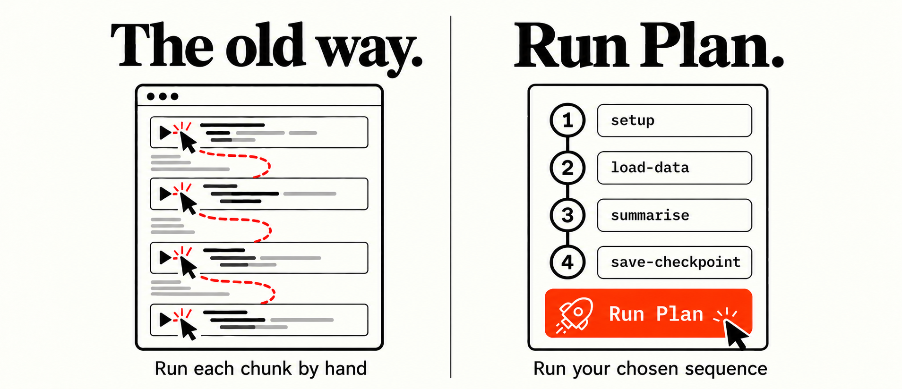

# Quarto run buttons for Positron



A small Positron extension that adds run buttons to notebooks. On a Quarto `.qmd` it adds four buttons to the editor title bar: Run Cells Above, Run Cells Below, Run All Cells, and Run Plan. On a Jupyter `.ipynb` it adds Run Plan.

Status: version 0.2.0. The first three buttons have been in regular use. Run Plan in this version has been verified by hand in Positron 2026.09.1 in two settings. On a `.qmd`, the rocket button is in the editor title bar, and the demo plan "Out of notebook order" ran in the R console in plan order, with a banner before each chunk and the expected output. On a `.ipynb` open in Positron's notebook editor with an R kernel, the rocket button appears at the right-hand end of the bar above the notebook, after the kernel selector; the demo plan "Out of notebook order" ran the cells in plan order with each output under the right cell, for cells named by a `#| label:` comment and cells named by a `label:` tag; and the demo plan "Stops at the third cell" stopped at `fail-on-purpose` with its error shown and did not run `summarise`. Stopping at a failing first cell and the failure notification have also been seen there: with a Python kernel attached to the R demo notebook, the plan stopped at `setup` and the notification read `Run plan: stopped at "setup": SyntaxError: invalid syntax...`. Not yet verified by hand: the built-in VS Code notebook editor (the `notebook/toolbar` button and the `notebook.cell.execute` route), the Python demo notebook, a plan that stops on an error in a `.qmd`, a notebook with no kernel selected, and the wording of the other notifications (success, and failure in a `.qmd`). Those are covered only by the automated tests in `test/`, which use a stubbed console, notebook and kernel.

## The buttons

| Button | Icon | Where | What it does |
|---|---|---|---|
| Run Cells Above | `run-above` | `.qmd` | Calls the Quarto extension's `quarto.runCellsAbove`. |
| Run Cells Below | `run-below` | `.qmd` | Calls `quarto.runCellsBelow`. |
| Run All Cells | `run-all` | `.qmd` | Calls `quarto.runAllCells`. |
| Run Plan | `rocket` | `.qmd` and `.ipynb` | Reads `<notebook>.runplan.json` beside the notebook and runs the chunks or cells it lists, in the order the plan lists them. |

The Quarto extension registers its three run commands for the command palette only. This extension puts them on the title bar, where they are one click away.

## Run Plan

A plan is a named, ordered list of labels. It is useful when a set of chunks or cells has to be run in a particular order and someone other than the person running them decides which: a collaborator, a script, or a coding agent that has edited the notebook and needs its owner to run specific steps. The sequence goes in a file and is run with one click after a confirmation.

| | `.qmd` | `.ipynb` |
|---|---|---|
| What a label names | an R chunk | a code cell |
| Where it runs | the R console | the notebook's own kernel, in place |
| Languages | R | whatever the kernel runs |
| Button | editor title bar | the bar above the notebook |

### Plan file format

The plan file sits beside the notebook and takes its name: `analysis.qmd` and `analysis.ipynb` both have `analysis.runplan.json`. A `.qmd` and a `.ipynb` with the same base name in one folder would share a plan file, so give them different names.

```json
{
  "notebook": "analysis.qmd",
  "plans": [
    {
      "name": "Recluster and save",
      "chunks": ["setup", "load-data", "cluster", "save-checkpoint"]
    },
    {
      "name": "Reload only",
      "chunks": ["setup", "load-data"]
    }
  ]
}
```

- `notebook` (optional) is the file name of the notebook the plan was written for. If it is present and does not match the open notebook, the plan is refused. The older key `qmd` is still accepted and means the same thing.
- `plans` is a non-empty list. Each plan has a `name` and a non-empty `chunks` list of labels. The key is `chunks` for both kinds of notebook. When the file holds more than one plan, a picker asks which to run.

### Naming a chunk in a `.qmd`

A chunk's label is taken from either header style:

````
```{r load-data, eval = FALSE}
```

```{r}
#| label: load-data
#| eval: false
```
````

### Naming a cell in a `.ipynb`

Jupyter cells have no labels of their own. Two conventions are read:

1. A `#| label: name` comment among the leading `#|` lines of the cell. This is the convention Quarto uses for notebooks, it is a comment in both R and Python, and it is visible in the cell.
2. A cell tag of the form `label:name`, for example `label:load-data`. Tags are stored in the cell metadata and can be edited from the notebook's cell tag controls.

The comment takes precedence when a cell has both, because it is the one a reader of the cell can see. Among tags, the first one with the `label:` prefix is used.

The tag needs the prefix because tags already carry other meanings. Notebooks in the wild have tags such as `parameters`, `hide-input` and `remove-cell`, and treating the first tag of a cell as its name would turn those into labels. With the prefix, a tag is a label only when someone meant it to be.

A label has no spaces. Only code cells can be named: a markdown or raw cell is never run, whatever it contains, and neither is a code cell with no label. A plan is refused if one of its labels matches more than one cell.

A leading `#| eval: false` comment is read as well, and such a cell is flagged in the confirmation dialog in the same way as a `.qmd` chunk.

### What a click does

1. Reads the plan file. If there is none, a message says so and nothing else happens.
2. Checks every label in the plan against the notebook as it is in the editor. A label the notebook does not have, a label used by more than one chunk or cell, or a chunk with no closing fence stops the run before it starts.
3. Shows a modal confirmation that lists the steps in the order they will run, with those marked `eval: false` flagged.
4. Saves the notebook if it has unsaved changes. The button reads "Save and run" in that case.
5. Runs the steps one at a time, waiting for each to finish before starting the next.
6. Stops at the first step that raises an error, and reports which step failed and which were not run. If every step succeeds, a notification says so.

For a `.qmd`, step 5 sends a one-line `message()` banner naming the chunk and then the chunk's body to the R console. The body is the text between the fences with the leading `#|` option lines removed.

For a `.ipynb`, step 5 executes the cell in place with the notebook's kernel, exactly as running that cell by hand would. Outputs appear under the cell. Nothing is sent to the console.

### Behaviour worth knowing

- Steps run in the order the plan lists them. Notebook order is ignored. A plan can therefore run a step that appears early in the notebook after one that appears later, for example a save step that sits above the step whose result it should save.
- Steps marked `eval: false` are run when a plan names them. Those are usually the slow or state-changing steps that a render should skip, which are often exactly the ones a plan exists to run. The confirmation dialog flags them so that this is visible before anything runs.
- The notebook is saved before running. The run itself does not need the file on disk, but code in a notebook may read the notebook file, and saving keeps the file on disk the same as what was run.
- A `.qmd` plan runs in the global environment of the R session attached to the console. If no R session is running, Positron starts one. Chunk bodies appear in the console and in its history. Banners appear in the console only.
- A `.ipynb` plan runs in the notebook's kernel session. If no kernel is selected, Positron asks for one when the first cell starts. If none is chosen, or the kernel does not run the cell's language, the cell reports no result; the plan waits five seconds, then stops at that cell and says that no result was reported. Later cells are not run.
- Interrupting the R session or the kernel during a plan counts as a failure of the current step, and the remaining steps are not started.

## Demo

The `demo/` folder has one `.qmd` and two `.ipynb` notebooks (R and Python), each with two plans: one that runs four steps in an order different from the notebook's, and one whose third step stops with an error. `demo/README.md` says what to click and what the output should be.

## Requirements

- Positron. The extension targets the VS Code extension API, but Run Plan on a `.qmd` uses Positron's own API (`positron.runtime.executeCode`) and reports an error in an editor that does not provide it. Run Plan on a `.ipynb` uses `positron.notebooks.runCells` when it is available. The APIs were read from Positron 2026.09.1; see Limitations.
- The Quarto extension, which Positron bundles. The first three buttons forward to its commands.
- An R session, for Run Plan on a `.qmd`. A kernel for the notebook, for Run Plan on a `.ipynb`.
- `node` on the PATH, for `install.sh` and the tests.

## Install

```bash
git clone https://github.com/david-priest/positron-qmd-run-buttons.git
cd positron-qmd-run-buttons
./install.sh
```

`install.sh` copies `package.json`, `extension.js` and `README.md` into `~/.positron/extensions/wing-lab.qmd-run-buttons-<version>/`. Reload afterwards with Developer: Reload Window from the command palette, or quit and reopen Positron.

```bash
./install.sh --check
```

`--check` reports whether the extension is installed and matches this checkout, and changes nothing. A Positron update can clear the extensions folder; if the buttons disappear, run `install.sh` again.

To update after pulling or editing, run `install.sh` again and reload. It overwrites the folder for the current version in place.

### Upgrading from 0.1.0

The install folder carries the version number, so installing 0.2.0 leaves the 0.1.0 folder where it was. With both present Positron may load the older one. `install.sh` lists any other versions it finds and does not remove them. Move the old folder to the Trash yourself, then reload the window:

```bash
mv ~/.positron/extensions/wing-lab.qmd-run-buttons-0.1.0 ~/.Trash/
```

## Tests

```bash
npm test
```

The tests have no dependencies. They stub the `vscode` module, replace the console with a fake `executeCode`, and replace notebooks with fake documents and a fake kernel. They cover the chunk parser, cell naming by comment and by tag and the precedence between them, plan file validation, duplicate labels, plan-order sequencing, stopping at the first failure for both kinds of notebook, markdown cells being skipped, and the command from click to notification.

## Design notes

**The run buttons delegate to Quarto's commands.** Declaring `quarto.runCellsBelow` in this extension's `contributes.commands` in order to attach an icon to it would collide with Quarto's own declaration of the same id. The extension therefore owns three ids of its own (`qmdRunButtons.*`) and forwards each with `executeCommand`. If the target command is not registered, because Quarto is disabled or has renamed the command, the button names the missing command.

**The buttons are in the `navigation` group.** That group is what places an `editor/title` item inline. Items in any other group go to the `…` overflow menu.

**Run Plan is always visible.** An earlier version showed the button only when a plan file existed, using a context key. After a window reload the notebook was already the active editor when the extension activated, no editor-change event fired, the key was never set, and the button stayed hidden. An always-visible button that says when there is no plan has no such state to get wrong.

**Run Plan has an icon.** Positron moves a title-bar item without an icon into the `…` overflow menu, even in the `navigation` group.

**Plan order is honoured.** The alternative, running the named steps in notebook order, would make it impossible to express a sequence that differs from the notebook's layout, and the plan's author has already decided the order.

**Each `.qmd` chunk is a separate console execution.** The extension waits for the promise returned by `executeCode` before sending the next chunk. That promise rejects when the R session reports an error, which is how the run stops. Code is sent with `allowIncomplete` set to true: with false, Positron's console holds code that R does not report as complete in the input box and never runs it, and the plan would wait indefinitely. With true, a chunk that does not parse reaches R, fails with a syntax error, and stops the plan. Chunk bodies use the `non-interactive` execution mode, because `interactive` mode prepends whatever is already typed in the console input.

**The notebook button is contributed twice.** Positron opens `.ipynb` files in its own notebook editor by default. The bar above that editor is Positron's editor action bar, which is built from the `editor/title` menu among others, so the button is contributed to `editor/title` for that editor. When the notebook is open in the built-in VS Code notebook editor instead, the button is contributed to `notebook/toolbar`, in the `navigation/execute` group. The two contributions have different `when` clauses, so only one applies at a time.

**Notebook cells are started through the editor that shows them.** For Positron's notebook editor the extension calls `positron.notebooks.runCells` with one cell index. If that reports that it has no such notebook, the notebook is open in the built-in editor, and the extension runs the `notebook.cell.execute` command with the cell's range and the notebook's URI. Both routes end in the same notebook execution service.

**A notebook cell's result is read from `NotebookCell.executionSummary.success`.** The extension listens for notebook change events while a cell runs and takes the first one for that cell that carries a boolean `success`. The field is cleared when an execution is created, so a result left by an earlier run is not mistaken for the new one.

## Limitations

- Not everything has been tested by hand in Positron. See Status for what has and what has not.
- In a `.qmd`, R chunks only. Chunks in other languages are not seen by the parser and cannot be named in a plan.
- The `.qmd` parser is line-based. It recognises fences that start at the beginning of a line with exactly three backticks, so chunks nested inside lists or callouts with indentation are not found.
- Only `eval = FALSE`, `eval = F` and `#| eval: false` are recognised as switching evaluation off. A conditional `eval` expression is not evaluated, and the step is not flagged. This affects only the flag in the dialog; the step runs either way.
- Other chunk options have no effect on a `.qmd` plan. A plan does not apply `fig.width`, `cache`, `echo` and so on.
- The behaviour described in the design notes was confirmed by reading the code of one Positron release. For the console, Positron's API declaration documents the promise as resolving with the result and does not state that it rejects on error; the extension also records the `onFailed` callback of the execution observer, which the declaration does document. For notebooks, the declaration of `positron.notebooks.runCells` does not say when its promise resolves. A later release could change either.
- For notebooks, the extension relies on the request to run a cell resolving after the cell has finished. That holds for the kernels Positron provides. With a notebook controller from another extension that returns before the cell finishes, a cell that takes longer than five seconds would be reported as having no result, and the plan would stop there.
- Starting a plan while a cell it names is already running will cancel that cell, because Positron's notebook editor treats a run request for a running cell as a request to stop it. Wait for the notebook to be idle before clicking.
- The Run Plan button on a notebook has been seen in Positron's notebook editor only. Its position in the built-in VS Code notebook editor has not been checked. If it does not appear, Run Plan is also in the command palette while a `.ipynb` is active.
- Run Plan appears only when the `.ipynb` is open in a notebook editor. In one test, a `.ipynb` opened from the command-line launcher was shown as raw JSON text, with no button. Reopening it with Reopen Editor With... and choosing a notebook editor brought the button back.
- A notebook runs on whichever kernel is attached to it, which may not match its language. In one test a Python session was already running, Positron attached a Python kernel to the R demo notebook, and the first cell failed with a Python syntax error; the plan stopped there, as it should. After saving, the notebook's `language_info.name` read `python`, because Positron writes the selected kernel's language into the notebook. The notebook had declared R through `language_info` and named no kernelspec. Positron's code picks a kernel from `language_info.name`, then `kernelspec.language`, and falls back to the language of the foreground session when that has not selected one; why the fallback applied here was not established. Check the kernel shown above the notebook before running a plan.
- A plan cannot be cancelled from the editor once it has started. Interrupt R or the kernel to stop it.
- macOS and Linux install script only. On Windows, copy the three files by hand into the equivalent extensions folder.

## Licence

MIT. See `LICENSE`.

The banner's rocket is adapted from the [Microsoft Codicons rocket](https://github.com/microsoft/vscode-codicons/blob/6b53088f5c55bce7107fb579765364f59cd4ad5d/src/icons/rocket.svg), licensed under [CC BY 4.0](https://creativecommons.org/licenses/by/4.0/), and is shown recoloured and scaled.
